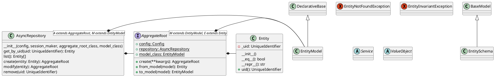

# Architecture

```plantuml
@startuml
class BaseModel
class DeclarativeBase

exception EntityNotFoundException
exception EntityInvariantException
abstract class Service
abstract class ValueObject

class EntitySchema
BaseModel <|-- EntitySchema

class EntityModel
DeclarativeBase <|-- EntityModel

class Entity {
    -_uid: UniqueIdentifier
    __init__()
    __eq__(): bool
    __repr__(): str
    +uid(): UniqueIdentifier
}
interface AggregateRoot<M extends EntityModel, E extends Entity> {
    {static} +config: Config
    {static} +repository: AsyncRepository
    {static} +model_class: EntityModel
    +create(**kwargs): AggregateRoot
    +from_model(model): Entity
    +to_model(model): EntityModel
}
AggregateRoot *- EntityModel
AggregateRoot *- Entity

class AsyncRepository<A extends AggregateRoot, M extends EntityModel> {
    __init__(config, session_maker, aggregate_root_class, model_class)
    get_by_uid(uid: UniqueIdentifier): Entity
    list(): Entity[]
    create(entity: Entity): AggregateRoot
    modify(entity): AggregateRoot
    remove(uid: UniqueIdentifier)
}
AsyncRepository *- AggregateRoot
AsyncRepository *- EntityModel
@enduml
```